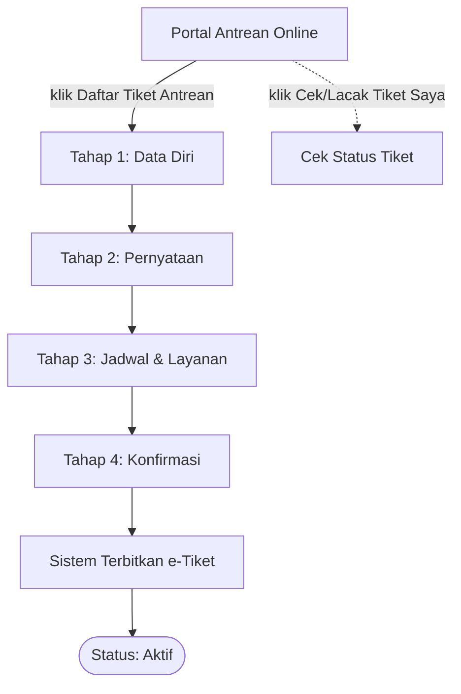
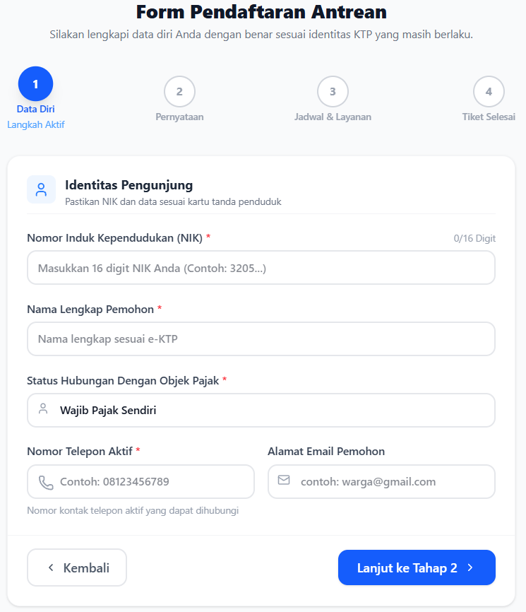
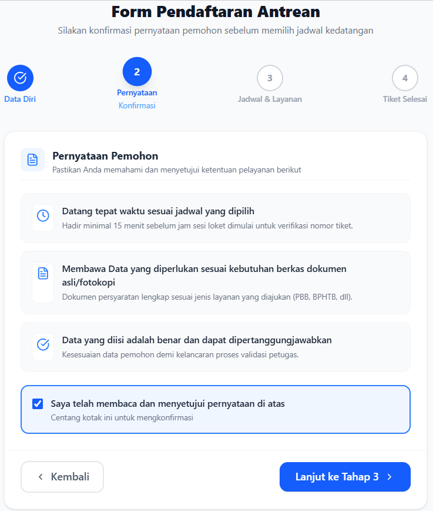
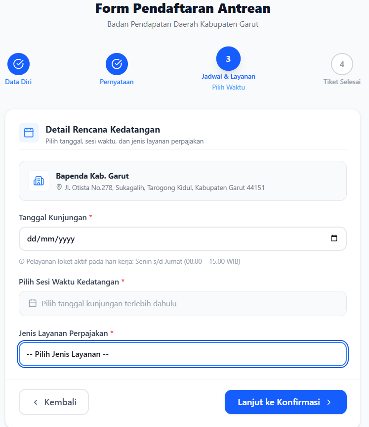
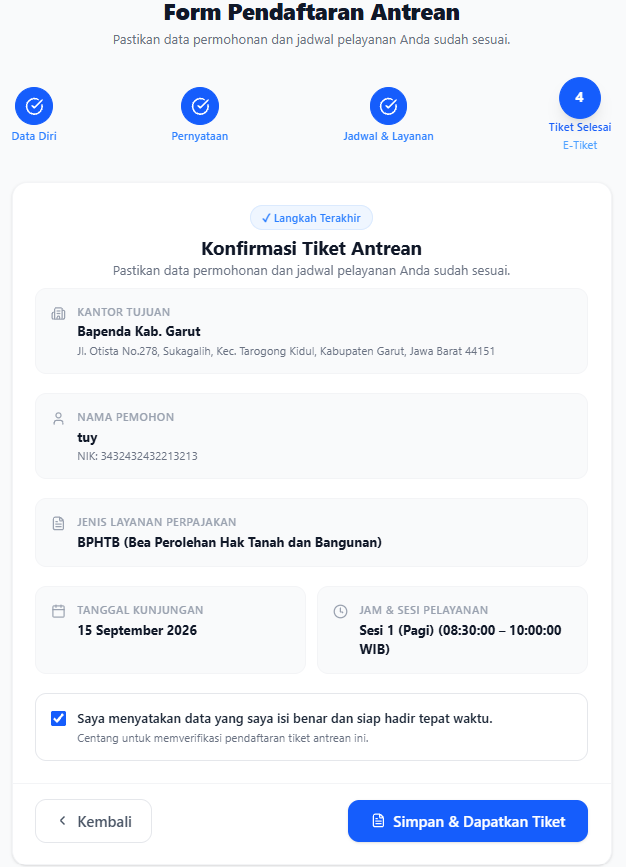
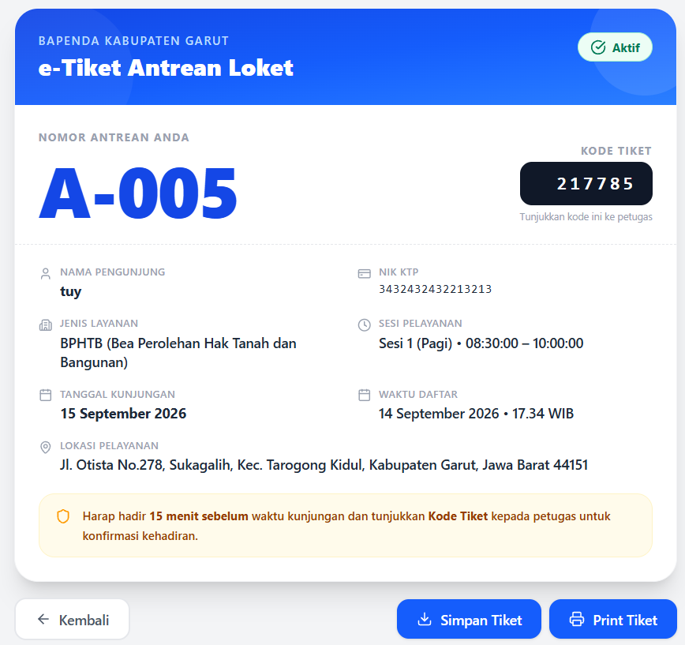
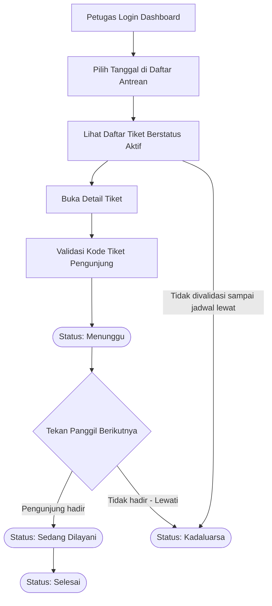
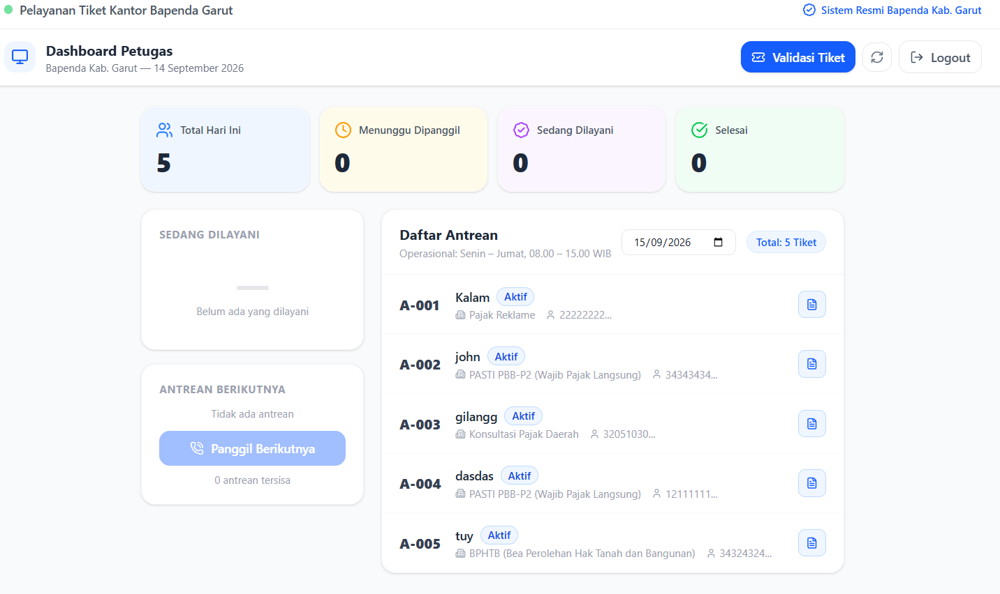
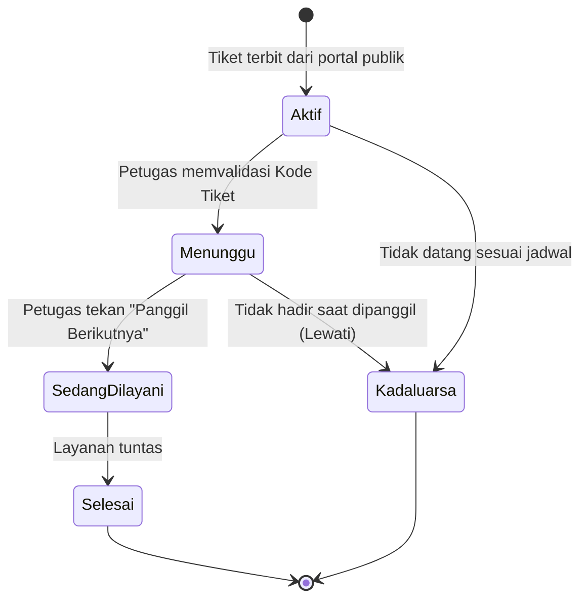
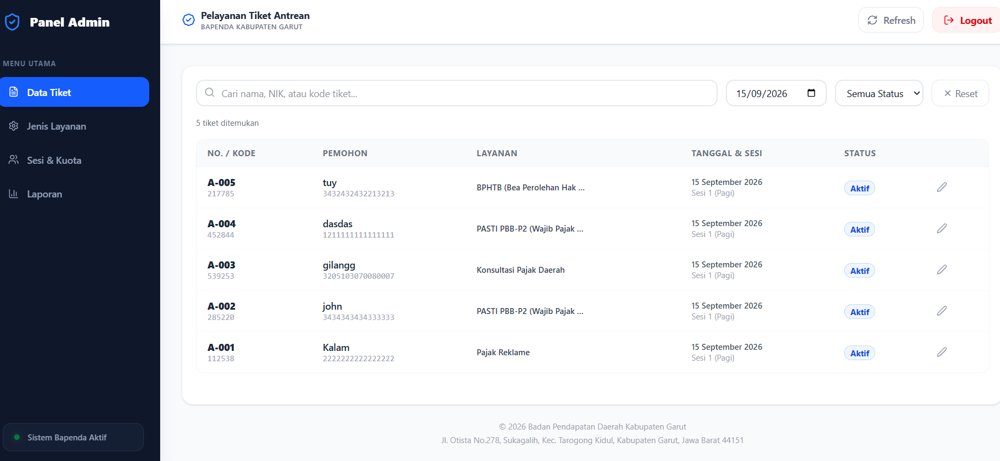

# Sistem Tiket Antrean Online — Bapenda Kabupaten Garut

Sistem tiket antrean online untuk pelayanan tatap muka di Badan Pendapatan Daerah (Bapenda) Kabupaten Garut. Pengunjung dapat mendaftar tiket antrean secara online sebelum datang ke kantor, sementara petugas dan admin mengelola antrean serta layanan melalui dashboard masing-masing.

## Daftar Isi

- [Tentang Sistem](#tentang-sistem)
- [Aktor & Peran](#aktor--peran)
- [Alur Pendaftaran Tiket (Pengunjung)](#alur-pendaftaran-tiket-pengunjung)
- [Alur Validasi & Pelayanan (Petugas)](#alur-validasi--pelayanan-petugas)
- [Siklus Status Tiket](#siklus-status-tiket)
- [Panel Admin](#panel-admin)
- [Rancangan Data](#rancangan-data)
- [Roadmap Pengembangan Lanjutan](#roadmap-pengembangan-lanjutan)

---

## Tentang Sistem

Sebelum sistem ini ada, wajib pajak harus mengantre langsung di kantor Bapenda untuk layanan seperti PBB-P2, BPHTB, konsultasi pajak daerah, dan retribusi lainnya. Sistem ini memindahkan proses pengambilan nomor antrean ke online, sehingga wajib pajak cukup datang sesuai jadwal yang mereka pilih sendiri.

Sistem terdiri dari tiga sisi aplikasi:

| Sisi | Digunakan oleh | Fungsi utama |
|---|---|---|
| **Portal Publik** | Pengunjung / wajib pajak | Daftar tiket antrean, cek/lacak tiket |
| **Dashboard Petugas** | Petugas loket | Validasi kedatangan, panggil nomor, tandai status layanan |
| **Panel Admin** | Admin Bapenda | Kelola jenis layanan, sesi & kuota, data tiket, laporan |

---

## Aktor & Peran

| Aktor | Peran dalam sistem | Akses |
|---|---|---|
| **Pengunjung (Wajib Pajak)** | Mendaftar tiket antrean online, menerima e-tiket berisi Kode Tiket, menunjukkan kode tersebut ke petugas saat tiba | Portal publik, tanpa login |
| **Petugas** | Memvalidasi Kode Tiket, memanggil nomor antrean, menandai status layanan (Sedang Dilayani / Selesai / Lewati) | Dashboard Petugas, login |
| **Admin** | Mengelola jenis layanan, sesi & kuota, memantau/mengedit data tiket, melihat laporan | Panel Admin, login |

---

## Alur Pendaftaran Tiket (Pengunjung)

Pengunjung mendaftar melalui portal publik dalam 4 tahap, lalu menerima e-tiket berisi **Kode Tiket** numerik (bukan QR code) yang nantinya ditunjukkan ke petugas.



### Tahap 1 — Data Diri

Field yang diisi: NIK (16 digit), Nama Lengkap Pemohon, Status Hubungan dengan Objek Pajak, Nomor Telepon Aktif (wajib), Alamat Email Pemohon (opsional).



### Tahap 2 — Pernyataan

Pengunjung menyetujui ketentuan: datang tepat waktu (minimal 15 menit sebelum sesi), membawa dokumen sesuai jenis layanan, dan data yang diisi benar.



### Tahap 3 — Jadwal & Layanan

Pengunjung memilih tanggal kunjungan, sesi waktu (dimuat otomatis setelah tanggal dipilih), dan jenis layanan perpajakan. Lokasi kantor saat ini tetap (satu lokasi: Bapenda Kab. Garut).



### Tahap 4 — Konfirmasi

Ringkasan data ditampilkan untuk diverifikasi ulang sebelum tiket diterbitkan.



### e-Tiket (hasil akhir)

e-Tiket berisi Nomor Antrean, **Kode Tiket** (kode numerik yang harus ditunjukkan ke petugas — pengganti QR code), data pemohon, jenis layanan, jadwal, waktu pendaftaran, dan lokasi pelayanan.



---

## Alur Validasi & Pelayanan (Petugas)

Setiap tiket yang berhasil didaftarkan otomatis muncul di **Dashboard Petugas**, pada daftar antrean yang bisa difilter berdasarkan tanggal.



Dashboard Petugas menampilkan ringkasan real-time (Total Hari Ini, Menunggu Dipanggil, Sedang Dilayani, Selesai), panel "Sedang Dilayani", panel "Antrean Berikutnya" dengan tombol **Panggil Berikutnya**, serta daftar antrean lengkap per tanggal.



---

## Siklus Status Tiket



| Status | Deskripsi |
|---|---|
| **Aktif** | Tiket baru terbit dari portal publik; pengunjung belum divalidasi kehadirannya |
| **Menunggu** | Petugas sudah memvalidasi Kode Tiket pengunjung; menunggu giliran dipanggil |
| **Sedang Dilayani** | Petugas menekan "Panggil Berikutnya"; pengunjung sedang diproses di loket |
| **Selesai** | Layanan tuntas |
| **Kadaluarsa** | Pengunjung tidak datang sesuai jadwal, atau tidak hadir saat dipanggil (dilewati petugas) |

---

## Panel Admin

Panel Admin memiliki 4 menu utama:



| Menu | Fungsi |
|---|---|
| **Data Tiket** | Melihat seluruh tiket per tanggal (bisa dicari berdasarkan nama/NIK/kode tiket, difilter status), serta mengedit data tiket |
| **Jenis Layanan** | Menambahkan/mengatur jenis layanan perpajakan (mis. PBB-P2, BPHTB, Konsultasi Pajak Daerah, Pajak Reklame) |
| **Sesi & Kuota** | Menambahkan sesi layanan (nama sesi, jam mulai, jam selesai) beserta kuotanya |
| **Laporan** | Melihat Total Tiket Terdaftar berdasarkan filter rentang tanggal |

---

## Rancangan Data

Entitas utama yang perlu ada pada basis data:

- **Tiket** — nomor antrean, kode tiket, status, NIK, nama pemohon, no. telepon, email (opsional), jenis layanan, tanggal kunjungan, sesi, waktu daftar, lokasi pelayanan
- **Jenis Layanan** — nama layanan, deskripsi
- **Sesi** — nama sesi, jam mulai, jam selesai, kuota
- **Akun Petugas/Admin** — kredensial login, peran (petugas/admin)

---

## Roadmap Pengembangan Lanjutan

- [ ] Notifikasi otomatis (WhatsApp/Email) saat tiket terbit dan saat mendekati giliran dipanggil
- [ ] Dukungan multi-lokasi/cabang kantor pelayanan
- [ ] Manajemen akun petugas dari Panel Admin (saat ini belum ada menu terpisah)
- [ ] Jalur prioritas untuk lansia, disabilitas, dan ibu hamil
- [ ] Survei kepuasan masyarakat (SKM) setelah status Selesai
- [ ] Laporan lanjutan: rata-rata waktu tunggu, jam sibuk, tingkat kadaluarsa/no-show

---

## Struktur Folder Dokumentasi

```
docs/
└── screenshots/
    ├── 01-portal-beranda.png
    ├── 02-form-tahap1-data-diri.png
    ├── 03-form-tahap2-pernyataan.png
    ├── 04-form-tahap3-jadwal-layanan.png
    ├── 05-form-tahap4-konfirmasi.png
    ├── 06-e-tiket.png
    ├── 07-dashboard-petugas.png
    └── 08-panel-admin.png
```

Pastikan folder `docs/screenshots/` ini ikut di-push ke repository agar gambar tampil di README GitHub.
